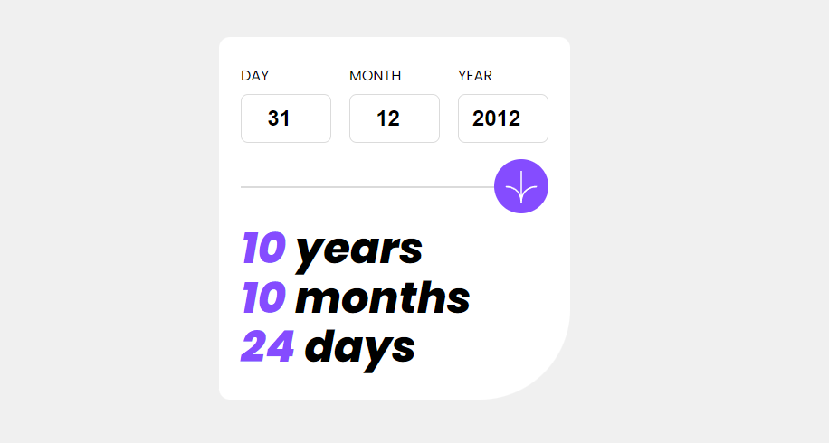

# Trabajando con fechas en JavaScript



Continuando con el proyecto, es necesario calcular cuánto tiempo ha pasado desde la fecha ingresada a la fecha actual. Si bien existen muchas librerías que nos ayudan a trabajar con fechas, en este caso vamos a utilizar el objeto `Date` que viene incluido en JavaScript.

## El objeto Date

El objeto `Date` nos permite trabajar con fechas en JavaScript. Para crear una nueva instancia de este objeto podemos utilizar el operador `new`:

```js
const date = new Date();
console.log(date); // 2021-11-25T19:00:00.000Z
```

Si no le pasamos ningún argumento, el objeto `Date` nos devuelve la fecha actual. Si queremos crear una fecha específica, podemos pasarle un string con la fecha que queremos crear:

```js
const date = new Date("2021-11-25");
console.log(date); // 2021-11-25T03:00:00.000Z
```

En este caso, la fecha que nos devuelve es la fecha de hoy a las 00:00:00.000. Si queremos crear una fecha con una hora específica, podemos pasarle un string con la fecha y la hora:

```js
const date = new Date("2021-11-25 13:00:00");
console.log(date); // 2021-11-25T16:00:00.000Z
```

En este caso, la fecha que nos devuelve es la fecha de hoy a las 13:00:00.000. Si queremos crear una fecha con una hora específica en una zona horaria específica, podemos pasarle un string con la fecha, la hora y la zona horaria:

```js
const date = new Date("2021-11-25 13:00:00 GMT-0300");
console.log(date); // 2021-11-25T16:00:00.000Z
```

## Métodos del objeto Date

El objeto `Date` tiene varios métodos que nos permiten trabajar con fechas. Algunos de los más utilizados son:

- `getFullYear()`: devuelve el año de la fecha.
- `getMonth()`: devuelve el mes de la fecha (0-11).
- `getDate()`: devuelve el día del mes de la fecha (1-31).
- `getDay()`: devuelve el día de la semana de la fecha (0-6).
- `getHours()`: devuelve la hora de la fecha (0-23).
- `getMinutes()`: devuelve los minutos de la fecha (0-59).
- `getSeconds()`: devuelve los segundos de la fecha (0-59).
- `getMilliseconds()`: devuelve los milisegundos de la fecha (0-999).
- `getTime()`: devuelve el tiempo transcurrido en milisegundos desde el 1 de enero de 1970 hasta la fecha definida.

Para mayor información sobre el objeto `Date` y sus métodos, puedes consultar la [documentación oficial](https://developer.mozilla.org/es/docs/Web/JavaScript/Reference/Global_Objects/Date).

## Calculando el tiempo transcurrido

Vamos a integrar el siguiente código en nuestro proyecto para calcular el tiempo transcurrido desde la fecha ingresada hasta la fecha actual:

```vue
<script setup>
import { reactive, ref } from "vue";

const birthday = {
  day: null,
  month: null,
  year: null,
};

const birthdayResult = reactive({
  years: "--",
  months: "--",
  days: "--",
});

const birthdayErrors = reactive({
  day: {
    error: false,
    message: "",
  },
  month: {
    error: false,
    message: "",
  },
  year: {
    error: false,
    message: "",
  },
});

const handleClick = () => {
  console.log(birthday);
  console.log(birthdayErrors);

  // validaciones para DD
  if (birthday.day > 31 || birthday.day < 1 || birthday.day === null) {
    birthdayErrors.day.error = true;
    birthdayErrors.day.message = !birthday.day
      ? "This field is required"
      : "Must be a valid day";
  } else {
    birthdayErrors.day.error = false;
    birthdayErrors.day.message = "";
  }

  // validaciones para MM
  if (birthday.month === null || birthday.month < 1 || birthday.month > 12) {
    birthdayErrors.month.error = true;
    birthdayErrors.month.message = !birthday.month
      ? "This field is required"
      : "Must be a valid month";
  } else {
    birthdayErrors.month.error = false;
    birthdayErrors.month.message = "";
  }

  // validaciones para YYYY
  const currentYear = new Date().getFullYear(); // 2023
  if (
    birthday.year === null ||
    birthday.year < 0 ||
    birthday.year > currentYear
  ) {
    birthdayErrors.year.error = true;
    birthdayErrors.year.message =
      birthday.year === null
        ? "This field is required"
        : "Must be a valid year";
  } else {
    birthdayErrors.year.error = false;
    birthdayErrors.year.message = "";
  }


  if(!birthdayErrors.day.error && !birthdayErrors.month.error && !birthdayErrors.year.error) {
  
    const currentDate = new Date();
    const parcialDate = new Date(`${birthday.year}-${birthday.month}-${birthday.day} GMT-03:00`);
    const dateDiff = new Date(currentDate.getTime() - parcialDate.getTime());
    birthdayResult.years = dateDiff.getFullYear() - 1970;
    birthdayResult.months = dateDiff.getMonth();
    birthdayResult.days = dateDiff.getDate() - 1;

  }
};
</script>

<template>
  <main class="main-container">
    <div class="card">
      <!-- form -->
      <form class="form">
        <div class="form-group">
          <label for="">Day</label>
          <input
            v-bind:class="birthdayErrors.day.error ? 'input-error' : ''"
            type="number"
            placeholder="DD"
            v-model="birthday.day"
          />
          <span>{{ birthdayErrors.day.message }}</span>
        </div>
        <div class="form-group">
          <label for="">Month</label>
          <input
            v-bind:class="birthdayErrors.month.error ? 'input-error' : ''"
            type="number"
            placeholder="MM"
            v-model="birthday.month"
          />
          <span>{{ birthdayErrors.month.message }}</span>
        </div>
        <div class="form-group">
          <label for="">Year</label>
          <input
            v-bind:class="birthdayErrors.year.error ? 'input-error' : ''"
            type="number"
            placeholder="YYYY"
            v-model="birthday.year"
          />
          <span>{{ birthdayErrors.year.message }}</span>
        </div>
      </form>

      <div class="divisor-container">
        <hr class="divisor" />
        <button v-on:click="handleClick" class="divisor__button">
          
        </button>
      </div>

      <div class="result-container">
        <p class="result-container__item">
          <span>
            {{ birthdayResult.years }}
          </span>
          years
        </p>
        <p class="result-container__item">
          <span>
            {{ birthdayResult.months }}
          </span>
          months
        </p>
        <p class="result-container__item">
          <span>
            {{ birthdayResult.days }}
          </span>
          days
        </p>
      </div>
    </div>
  </main>
</template>

<style scoped>
.main-container {
  width: 100%;
  height: 100vh;
  display: flex;
  justify-content: center;
  align-items: center;
}

.card {
  background-color: var(--white);
  padding: 30px 24px;
  border-radius: 12px 12px 100px 12px;
}

.form {
  display: flex;
  gap: 20px;
}
.form-group {
  display: flex;
  flex-direction: column;
  gap: 8px;
  width: 30%;
}

.form-group label {
  text-transform: uppercase;
}

.form-group input {
  width: 100px;
  height: 54px;
  border-radius: 8px;
  border: 1px solid var(--light-grey);
  text-align: center;
  font-size: 1.5rem;
  font-weight: bold;
}

.form-group span {
  color: var(--light-red);
  font-size: 0.6rem;
  font-style: italic;
}

.divisor-container {
  position: relative;
}
.divisor {
  border: 1px solid var(--light-grey);
  margin: 40px 0;
}
.divisor__button {
  display: flex;
  justify-content: center;
  align-items: center;
  position: absolute;
  width: 60px;
  height: 60px;
  background-color: var(--purple);
  border-radius: 50%;
  top: -30px;
  right: 0;
}

.divisor__button img {
  width: 36px;
}

.input-error {
  border: 1px solid var(--light-red) !important;
}

.result-container {
}

.result-container__item {
  font-size: 3rem;
  font-weight: 800;
  color: var(--dark-grey);
  font-style: italic;
  line-height: 3.4rem;
}

.result-container__item span {
  color: var(--purple);
}
</style>
```

Como puedes ver, estamos utilizando el método `getTime()` para calcular la diferencia entre la fecha actual y la fecha ingresada. Este método nos devuelve el tiempo transcurrido en milisegundos desde el 1 de enero de 1970 hasta la fecha definida. Luego, estamos creando una nueva instancia de `Date` con el tiempo transcurrido y utilizando los métodos `getFullYear()`, `getMonth()` y `getDate()` para obtener los años, meses y días transcurridos.


