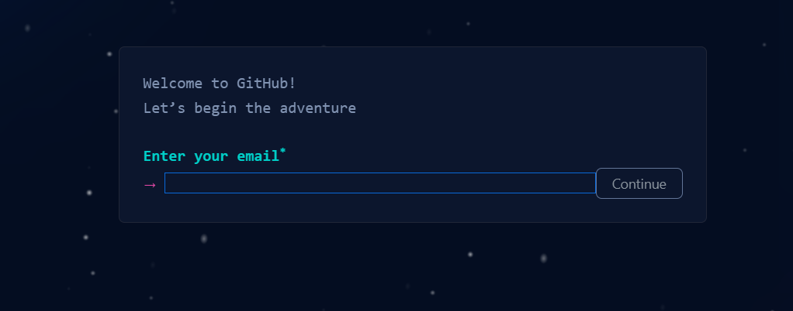
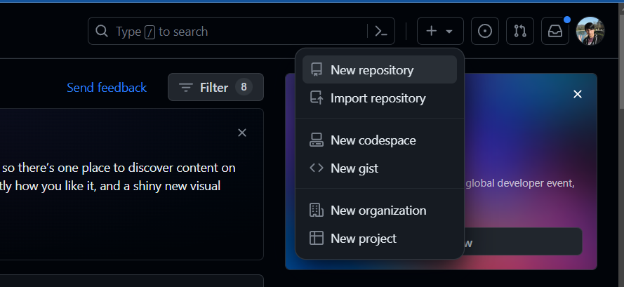
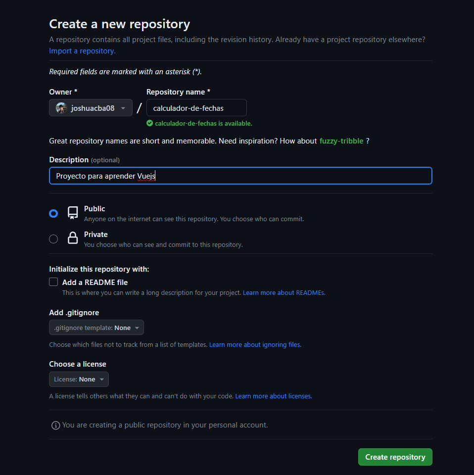
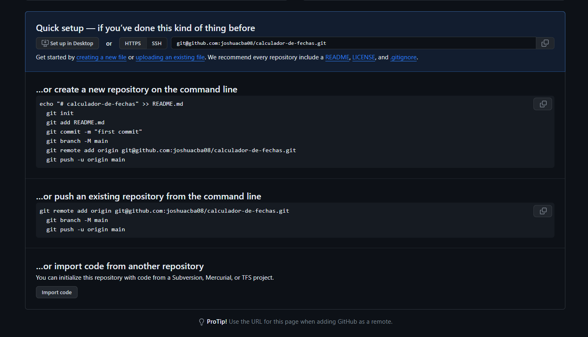
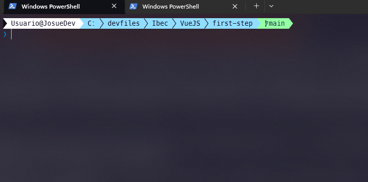
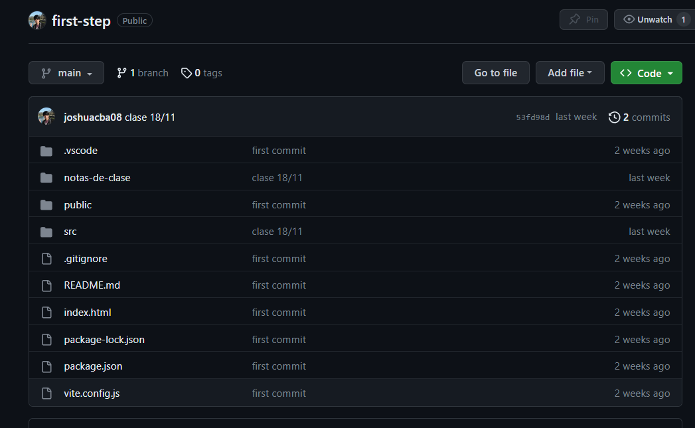

# Subiendo mi proyecto a GitHub

## Requisitos

- Tener instalado Git en tu computadora
- Tener una cuenta en GitHub

## Crear una cuenta en GitHub

Vamos a ingresar a [GitHub](https://github.com) y vamos a crear una cuenta.


Haremos clic en el botón **Sign up** y completaremos el formulario con nuestros datos.



Una vez que hayamos creado nuestra cuenta, vamos a iniciar sesión.

Cuando hayamos creado nuestra cuenta y hayamos iniciado sesión, vamos a crear un nuevo repositorio haciendo clic en el botón **New**.



Completamos los datos del repositorio y hacemos clic en el botón **Create repository**.



A continuación, vamos a visualizar dos baterias de comandos que nos permitirán subir nuestro proyecto a GitHub.



Es necesario entender cuál es la diferencia entre ambas baterias de comandos.

La primera batería de comandos es para cuando estamos creando un nuevo repositorio en GitHub y queremos subir nuestro proyecto a ese repositorio. Es decir, que el proyecto que queremos subir no tiene git inicializado.

En nuestro caso, Vue CLI usa Vite y Vite no inicializa git en el proyecto, por lo tanto, vamos a utilizar la primera batería de comandos.

La segunda batería de comandos es para cuando ya tenemos unicializado git en nuestro proyecto y queremos subirlo a GitHub.

## Ejecutar la primera batería de comandos

Vamos a copiar la primera batería de comandos y la vamos a ejecutar en nuestra terminal. Recuerda que debes estar ubicado en la carpeta de tu proyecto.



```bash
echo "# calculador-de-fechas" >> README.md
  git init
  git add README.md
  git commit -m "first commit"
  git branch -M main
  git remote add origin git@github.com:cuentaDeGitHub/calculador-de-fechas.git
  git push -u origin main
```

Al ejecutar la primera batería de comandos, se creará un archivo README.md, se inicializará git en nuestro proyecto, se agregará el archivo README.md al staging area, se creará un commit con el mensaje "first commit", se creará una rama llamada main, se agregará el repositorio remoto y se subirá el proyecto a GitHub.



